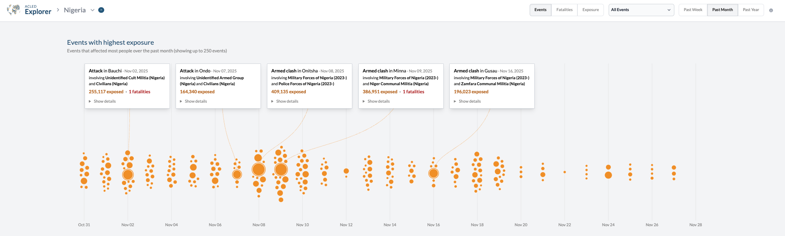
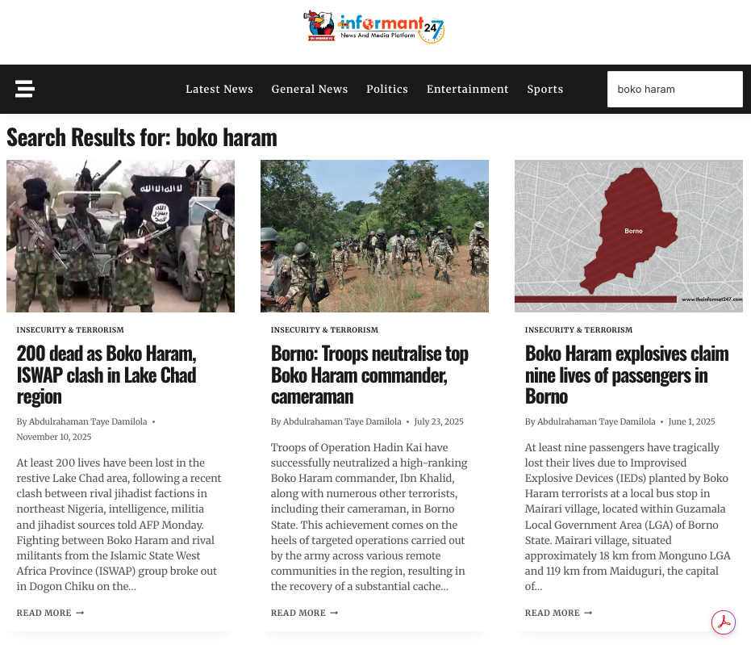
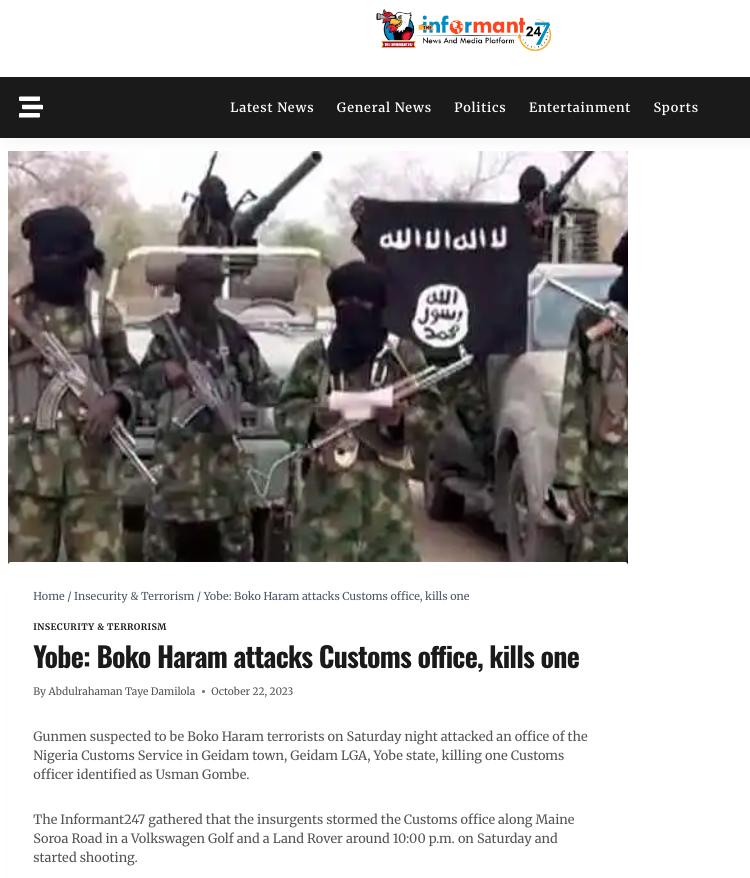

```{r, include = FALSE}
library(rvest)
library(tidyverse)
library(dplyr)
library(purrr)
library(xml2)
library(httr)
library(httr2)
library(acled.api)
library(readr)
library(stringr)
library(huggingfaceR)
library(DBI)
library(RSQLite)
library(scales)
library(ggplot2)
library(sf)
library(rnaturalearth)
library(rnaturalearthdata)
library(kableExtra)
library(broom)
library(knitr)
```


The GitHub repository for this project can be found at [https://github.com/zeinolf/SURV727_Final_Project](https://github.com/zeinolf/SURV727_Final_Project/tree/main).

## Introduction

News media plays a vital role in shaping public perceptions. Nowhere is the impact of media more evident than during violent events, when the tone and framing of coverage can profoundly influence public opinion, fear, and ultimately government responses. How violent incidents such as terrorist attacks or intrastate conflicts are reported and covered in the news can amplify perceived threat and shape narratives about perpetrators and victims. In this context, the media's commentary on terrorist attacks in regions plagued by violence becomes especially consequential, as local reporting helps construct the global understanding of perpetrators, their motives, and the scale of the threat they pose.

Boko Haram, formally known as “Jama'atu Ahl as-Sunnah li-Da'awati wal-Jihad” (“Western education is forbidden") is a Salafi-Jihadist group based in northeastern Nigeria and long regarded as one of Africa’s most violent insurgent terrorist organizations. When its founder Mohammed Yusuf died in 2009, the radical group became far more lethal under its new leader Abubakar Shekau, who assumed control and oversaw its expansion into a decentralized network of militant cells across Nigeria, Cameroon, Niger, and Chad. Boko Haram is best known for the 2014 Chibok schoolgirl kidnappings, in which 276 students were abducted, many forced into marriage or conversion, with many still missing or presumed dead . Internal divisions have defined the group for years, and beginning in 2015 many fighters defected to the Islamic State West Africa Province (ISWAP) due to frustration with Shekau’s tactics. After Shekau’s death by suicide bombing in 2021, thousands more fighters surrendered or joined ISWAP, leaving Boko Haram a weakened splinter faction with diminished leadership and capacity.

Given Boko Haram’s shifting organizational landscape, the group presents a compelling case for examining how broader contextual changes shape both its behavior and how it is portrayed in the media. Leadership transitions, especially the death of Abubakar Shekau, the fragmentation of fighters into rival factions like ISWAP, and the destabilizing effects of the COVID-19 pandemic all altered the group’s operational capacity, geographic spread, and public visibility. These developments provide a unique opportunity to analyze whether changes within the organization correspond to meaningful changes in how Nigerian media reported on its activities from 2019 to 2021.

Using Boko Haram's activity in Nigeria as a case study, this project will assess the degree of which the tone and sentiment that the media displays when they cover violent actors aligns with the actual intensity of said actors and events. Through the use data science tools and methods, it will leverage open-source data across multiple sources to understand this under researched phenomena. The resulting outcome of this project will answer the following question: **Does Nigerian media reporting on Boko Haram accurately reflect conflict dynamics? Or, does it instead amplify, downplay, and/or sensationalize the violence perpetrated by the group.**

<br>

## Methodology

#### *Armed Conflict Location & Event Data (ACLED)*

[ACLED](https://acleddata.com/) (Armed Conflict Location & Event Data) is a United States-based non-profit organization dedicated to monitoring global conflict and crisis trends. They collect real-time data on violence and demonstrations by triaging wide ranges of publicly available information (PAI) (including local news, national news, etc.) for synthesis into distinct events. With each event, they document variables such as actors, fatality estimates, locations, event-types, dates, and more. For an example of the types of events that ACLED collects, see Figure 1. Event-types are classified using strict definition-based inclusion criteria. To this date, ACLED is one of the most robust conflict-data collection projects, and is widely recognized as a reputable and reliable data source.

**Figure 1.** ACLED-compiled conflict events in Nigeria over past month (as of December 5, 2025)

{fig-align="center" width="710" height="255"}

For easy analysis, recent conflict data from ACLED can be viewed on their online dashboard tool. However, a look into conflict data from further back in time requires an API access token. This project specifically utilized the ACLED API in conjunction with the 'acled.api' package in R to obtain conflict data for Nigeria. For more information regarding API access, see [API Documentation](https://acleddata.com/api-documentation/getting-started "API Documentation"). To answer the research question, all ACLED event data that occurred in Nigeria between the dates of January 1, 2019 and December 31, 2021 was pulled via the API and subsequently stored into a SQL database for future use. Specific filtering and formatting of the data was mostly completed within this report for visualization. Key characteristics include actor names, event type, and total fatalities.

#### ***Scraping Nigerian News Websites***

In order to get an understanding of the sentiment of Nigerian media reporting on Boko Haram, this project scraped text content from three different Nigerian news websites: [TheInformant24/7](https://theinformant247.com/), [MegaNews](https://meganews.com.ng/), and [NewsHunter](https://thenewshunterblog.wordpress.com/). It was originally intended that the project would scrape large, major Nigerian news outlets, however, issues with cloudfare and connection timeouts prevented robust scraping. TheInformant24/7 is the largest news site out of the three, while NewsHunter is the smallest and functions as a sort of news-blog hybrid. All three sites use a wordpress-style website structure that was easily scrapable with the 'rvest' package.

To locate articles that directly mentioned Boko Haram, a simple search query ('boko haram') was utilized across all three websites. Results included links to articles that mentioned Boko Haram. For an example of what a standard search query and website result looked like, see Figure 2. Article links were then scraped across all search-page results, including any additional pages that were not initially displayed from the query. In total, 344 article links were scraped using this method. These links were then compiled into a single table and sorted by source.

**Figure 2.** A screenshot of the query search on TheInformant24/7

{fig-align="center" width="536"}

The list of 344 article links were then scraped in order to establish a large corpora of text content that could be used in future sentiment analysis. An example of an article scraped data can be seen in Figure 3. Data scraped included URL, source, publication date, title, and text content. This data was subsequently stored in a SQL database for use in analysis.

**Figure 3.** A screenshot of a Boko Haram-related article scraped from TheInformant24/7

{fig-align="center" width="515"}

<br>

## Understanding Boko Haram Events

Despite Boko Haram only contributing to a small fraction of total conflict activity in the defined time period, their events result in higher mean fatality levels overall. Figure 4 displays two graphs showing this comparison. On the top, the number of total violent events committed by Boko Haram is compared to the total number of violent events committed by all other Nigerian actors. Boko Haram events represent just a small proportion of activity in this period. The graph on the bottom then compares mean amount of fatalities per month committed by Boko Haram to other groups. Boko Haram appears to have consistent mean fatality levels compared to other groups from early 2019 to late 2020. However, in 2021, their mean fatality levels spike in comparison to other groups. From this period onward, Boko Haram is much more lethal than other armed actors. Given that mean fatalities per event fluctuate more sharply, with brief periods of heightened lethality in mid-2020 and late 2021, this data suggests that Boko Haram’s capacity for high-fatality attacks varies independently of overall event frequency.

**Figure 4.** Comparing violent conflict incidents and intensity between Boko Haram and other groups.

```{r,echo=FALSE, fig.align='center'}
con <- dbConnect(SQLite(), "../data/ng_acled.db")
ng_acled <- dbReadTable(con, "ng_acled")
dbDisconnect(con)


ng_acled |>
  filter(disorder_type == "Political violence") |>
  mutate(
    actor1 = str_to_lower(actor1),
    actor2 = str_to_lower(actor2),
    boko_flag = case_when(
      str_detect(actor1, "boko haram") | str_detect(actor2, "boko haram") ~ "Boko Haram",
      TRUE ~ "Other groups"
    )
  ) |>
  filter(!is.na(boko_flag)) |>
  mutate(
    event_date = as.Date(event_date),
    month = floor_date(event_date, "month")
  ) |>
  group_by(boko_flag, month) |>
  summarize(
    event_count = n(),
    mean_fatalities = mean(fatalities, na.rm = TRUE),
    .groups = "drop"
  ) |>
  pivot_longer(
    cols = c(event_count, mean_fatalities),
    names_to = "metric",
    values_to = "value"
  ) |>
  ggplot(aes(x = month, y = value, color = boko_flag)) +
  geom_line(linewidth = 1) +
  geom_point(size = 2) +
  facet_wrap(
    ~ metric, 
    scales = "free_y", 
    ncol = 1,
    labeller = as_labeller(c(
      event_count     = "Event frequency",
      mean_fatalities = "Mean fatalities per event"
    ))
  ) +
  scale_color_manual(
    values = c(
      "Boko Haram"   = "red",
      "Other groups" = "green"
    )
  ) +
  labs(
    x = "Month",
    y = NULL,
    color = "Actor Group",
    title = "Violent Conflict Intensity Over Time — Boko Haram vs Other Groups"
  ) +
  theme_minimal(base_size = 14) +
  theme(
    panel.background  = element_rect(fill = "black", color = NA),
    plot.background   = element_rect(fill = "black", color = NA),
    legend.background = element_rect(fill = "black", color = NA),
    panel.grid.major  = element_line(color = "grey20"),
    panel.grid.minor  = element_blank(),
    axis.text         = element_text(color = "white"),
    axis.title        = element_text(color = "white"),
    strip.text        = element_text(color = "white"),
    legend.text       = element_text(color = "white"),
    legend.title      = element_text(color = "white"),
    axis.text.x       = element_text(angle = 45, hjust = 1),
    plot.title = element_text(color = "white", face="bold", size = 11, hjust= 0.5),
    plot.subtitle = element_text(color = "white"),
    plot.caption = element_text(color = "white")
  )

#ggsave("../visualizations/acled_plot.png", width = 9, height = 7, dpi = 400)
```

Violent events perpetrated by Boko Haram within this period peak in mid-2020, in which Boko Haram clashes with the Nigerian Military and the Islamic State West Africa Provence (ISWAP) on numerous occasions. Figure 5 delineates the types of conflicts that Boko Haram engages in over time, with battle events consistently being the most prominent. Boko Haram also utilizes explosive devices, and most prominently, suicide bombers in their repertoire. Likewise, they engage in violence against civilians, with most occurrences happening at the peak of the event activity.

**Figure 5.** Violent event types perpetrated by Boko Haram over time

```{r, echo=FALSE, fig.align='center'}
ng_acled |>
  filter(disorder_type == "Political violence") |>
  mutate(
    actor1 = str_to_lower(actor1),
    actor2 = str_to_lower(actor2),
    boko_flag = case_when(
      str_detect(actor1, "boko haram") | str_detect(actor2, "boko haram") ~ "Boko Haram",
      TRUE ~ "Other groups"
    ),
    event_date = as.Date(event_date),
    month = floor_date(event_date, "month")
  ) |>
  filter(boko_flag == "Boko Haram") |>
  count(month, event_type)|>
  ggplot(aes(x = month, y = n, color = event_type)) +
  geom_line(linewidth = 1) +
  labs(
    title = "Boko Haram Event Types Over Time",
    x = "Month",
    y = "Number of events",
    color = "Event type"
  ) +
  theme_minimal()+
  theme(
    panel.background  = element_rect(fill = "black", color = NA),
    plot.background   = element_rect(fill = "black", color = NA),
    legend.background = element_rect(fill = "black", color = NA),
    panel.grid.major  = element_line(color = "grey20"),
    panel.grid.minor  = element_blank(),
    axis.text         = element_text(color = "white"),
    axis.title        = element_text(color = "white"),
    legend.text       = element_text(color = "white"),
    legend.title      = element_text(color = "white"),
    strip.text        = element_text(color = "white"),
    plot.title        = element_text(color = "white", face = "bold", size = 15, hjust = 0.5),
    plot.subtitle     = element_text(color = "white", size = 13, hjust = 0.5),
    axis.text.x       = element_text(angle = 45, hjust = 1)
  )

#ggsave("../visualizations/boko_events.png", width = 9, height = 7, dpi = 400)
```

## Sentiment Analysis

To understand media sentiment on Boko Haram coverage within the 2019-2021 time period, sentiment analysis was conducted using a text classification model from huggingface ([j-hartmann/emotion-english-distilroberta-base](https://huggingface.co/j-hartmann/emotion-english-distilroberta-base?text=Oh+wow.+I+didn%27t+know+that.)). This specific model analyzes text for Ekman’s 6 basic emotions: sadness, anger, fear, disgust, joy, surprise, as well as a neutral category. Figure 6 smooths the sentiment scores of each emotion and averages them by month to display how sentiment on Boko Haram coverage varies over time.

**Figure 6.** Change in emotion/sentiment of Boko Haram coverage over time

```{r, echo=FALSE, warning=FALSE,fig.align='center'}

con <- dbConnect(SQLite(), "../data/emotion_long.db")
emotion_long <- dbReadTable(con, "emotion_long")
dbDisconnect(con)

emotion_time <- emotion_long |>
  mutate(
    date  = suppressWarnings(mdy(pub_date_raw)),
    month = floor_date(date, unit = "month")
  ) |>
  filter(!is.na(month), !is.na(label)) |>
  group_by(month, label) |>
  summarize(
    mean_score = mean(score, na.rm = TRUE),
    n_articles = n_distinct(doc_id),
    .groups    = "drop"
  )

emotion_time_filtered <- emotion_time |>
  filter(month >= ymd("2019-01-01"),
         month <= ymd("2021-12-31"))

emotion_qtr_prop <- emotion_time_filtered |>
  mutate(quarter = floor_date(month, "quarter")) |>
  group_by(quarter, label) |>
  summarize(mean_score = mean(mean_score, na.rm = TRUE),
            .groups = "drop") |>
  group_by(quarter) |>
  mutate(
    total = sum(mean_score, na.rm = TRUE),
    prop  = ifelse(total > 0, mean_score / total, NA_real_)
  ) |>
  ungroup()

ggplot(emotion_qtr_prop, aes(x = quarter, y = prop, group = label)) +
  geom_smooth(
    color = NA,
    fill  = "grey30",
    alpha = 0.3,
    se    = TRUE,
    method = "loess",
    span   = 0.8,
    formula = y ~ x
  ) +
  geom_smooth(
    aes(color = label),
    se     = FALSE,
    method = "loess",
    span   = 0.8,
    linewidth = 1.3,
    formula = y ~ x
  ) +
  scale_y_continuous(labels = percent_format(), limits = c(0, 0.6)) +
  scale_x_date(date_breaks = "3 months", date_labels = "%b %y") +
  labs(
    title = "Sentiment analysis of Nigerian reporting on Boko Haram",
    x = NULL,
    y = "value",
    color = NULL
  ) +
  theme_minimal(base_size = 14) +
  theme(
    panel.background  = element_rect(fill = "black", color = NA),
    plot.background   = element_rect(fill = "black", color = NA),
    legend.background = element_rect(fill = "black", color = NA),
    panel.grid.major  = element_line(color = "grey20"),
    panel.grid.minor  = element_blank(),
    axis.text         = element_text(color = "white"),
    axis.title        = element_text(color = "white"),
    legend.text       = element_text(color = "white"),
    legend.title      = element_text(color = "white"),
    strip.text        = element_text(color = "white"),
    plot.title        = element_text(color = "white", face = "bold", size = 15, hjust = 0.5),
    plot.subtitle     = element_text(color = "white", size = 13, hjust = 0.5),
    axis.text.x       = element_text(angle = 45, hjust = 1)
  )

#ggsave("../visualizations/sentiment_plot.png", width = 9, height = 7, dpi = 400)


```

These results indicate that negative emotional tones are much more prominent than positive ones, although it varies over time. Neutral content outweighed a strong amount of the sentiment throughout this period, especially in late 2019 and mid 2020. Negative sentiment saw its highest peaks in early 2019, where sadness and disgust were prominent, as well as in mid 2020, where fear and anger saw their highest peaks. Given the brutal nature of Boko Haram attacks, it was expected that coverage would be negative overall, however, fluctuations in these negative emotions may help us obtain insight into whether violent events are correlated with them.

```{r, echo=FALSE}
#loading article data
con <- dbConnect(SQLite(), "../data/nigeria_news.db")
nigeria_news <- dbReadTable(con, "nigeria_news")
dbDisconnect(con)

#giving article data ids
article_data_id <- nigeria_news |>
  mutate(article_id = row_number())

#giving sentiment data ids
emotion_long_id <- emotion_long |>
  mutate(article_id = row_number())   

#joining articles to sentiment
emotion_joined <- emotion_long_id |>
  left_join(article_data_id|>
              select(article_id, pub_date_raw, source), by="article_id")|>
  mutate(
    pub_date = mdy(pub_date_raw.x), 
    month    = floor_date(pub_date, "month")
    )
```

Media slant is also an important factor in conducting this analysis. The specific opinions and makeup of a news organization and its ownership can have direct impact on the way in which it is reporting on specific issues. Figure 7 displays a high level view on the differences in emotion that each scraped-news source has when covering Boko Haram.

**Figure 7. Variation in Boko-Haram coverage sentiment across scraped outlets**

```{r, warning= FALSE, echo =FALSE,fig.align='center'}
#sentiment variation by news source
topic_summary <- emotion_joined|>
  group_by(source.x,label)|>
  summarize(
    mean_score=mean(score,na.rm=TRUE), 
    .groups="drop")

#plot
ggplot(topic_summary, aes(x=reorder(label,mean_score), y=mean_score, fill=label)) +
  geom_col(show.legend=FALSE) +
  coord_flip() +
  facet_wrap(~source.x) +
  labs(title="Sentiment Variation by News Outlet",
       x="Emotion", y="Average score") +
  theme_minimal()+
  theme(
    panel.background  = element_rect(fill = "black", color = NA),
    plot.background   = element_rect(fill = "black", color = NA),
    legend.background = element_rect(fill = "black", color = NA),
    panel.grid.major  = element_line(color = "grey20"),
    panel.grid.minor  = element_blank(),
    axis.text         = element_text(color = "white"),
    axis.title        = element_text(color = "white"),
    legend.text       = element_text(color = "white"),
    legend.title      = element_text(color = "white"),
    strip.text        = element_text(color = "white", size = 7, face= "bold"),
    plot.title        = element_text(color = "white", face = "bold", size = 18, hjust = 0.5),
    plot.subtitle     = element_text(color = "white", hjust = 0.5),
    axis.text.x       = element_text(angle = 45, hjust = 1)
  )

#ggsave("../visualizations/sentiment_outlet.png", width = 9, height = 7, dpi = 400)
```

TheInformant24/7, the most scraped media website in this analysis, has the highest variation in sentiment compared to the others. TheNewHunter, likely due to its small sample size, has very little variation. By and far, neutral tone tends to outweigh all other emotions across news sites. Interestingly, the second highest emotion for the MegaNews site is actually joy, which seems unordinary given that coverage on Boko Haram usually deals with violent conflict. For the other two sites, fear is the highest emotion out of the six Ekman emotions.

<br>

## Comparison & Further Analysis

The true objective of this project is to compare the sentiment of Nigerian reporting on Boko Haram to that of Boko Haram's conflict intensity. To do so, percentage of negative sentiment in the scraped content and the total number of fatalities committed by Boko Haram were aggregated by month. This then allows us to visualize how fatalities compared to sentiment at each month within the specified time period. Figure 8 below graphs negative media sentiment percentage on Boko Haram coverage against the total fatality levels within Boko Haram incidents by month.

**Figure 8. Sentiment vs fatalities by month**

```{r, echo=FALSE, message=FALSE, fig.align='center'}
#reformatting data to get it by month
emotion_month <- emotion_joined |>
  group_by(month, label) |>
  summarize(mean_score = mean(score, na.rm=TRUE), .groups="drop") |>
  group_by(month) |>
  mutate(
    total = sum(mean_score, na.rm=TRUE),
    prop  = mean_score / total) |>
  ungroup()

#formatting with negative sentiment
sentiment_month <- emotion_month |>
  mutate(
    type = ifelse(label %in% c("anger","fear","sadness","disgust"), "negative", "other")
    )|>
  group_by(month, type)|>
  summarize(sentiment = sum(prop, na.rm=TRUE), .groups="drop")|>
  pivot_wider(names_from=type, values_from=sentiment)


#limiting acled data ot just boko harm events
acled_boko <- ng_acled |>
  mutate(
    actor1 = str_to_lower(actor1),
    actor2 = str_to_lower(actor2)
  )|>
  filter(
    str_detect(actor1, "boko haram") |
    str_detect(actor2, "boko haram")
  )

#getting boko haram fatalities by month
conflict_month_boko <- acled_boko|>
  mutate(
    event_date = as.Date(event_date),
    month = floor_date(event_date, "month")
  )|>
  group_by(month)|>
  summarize(
    events = n(),
    fatalities_total = sum(fatalities, na.rm = TRUE),
    fatalities_mean  = mean(fatalities, na.rm = TRUE),
    .groups = "drop"
  )

#joining togeher with sentiment
sentiment_conflict_boko <- sentiment_month|>
  inner_join(conflict_month_boko, by = "month")

#plotting
ggplot(sentiment_conflict_boko, 
       aes(x = negative, y = fatalities_total)) +
  geom_point(size = 2, alpha = 0.8, color = "red") +
  geom_smooth(method = "lm", se = TRUE, color = "red", formula = y ~ x) +
  labs(
    title = "Negative Media Sentiment vs Boko Haram Fatality Levels",
    x = "Negative Emotion Proportion",
    y = "Total Boko Haram Fatalities"
  ) +
  theme_minimal()+
  theme(
    panel.background  = element_rect(fill = "black", color = NA),
    plot.background   = element_rect(fill = "black", color = NA),
    legend.background = element_rect(fill = "black", color = NA),
    panel.grid.major  = element_line(color = "grey20"),
    panel.grid.minor  = element_blank(),
    axis.text         = element_text(color = "white"),
    axis.title        = element_text(color = "white"),
    legend.text       = element_text(color = "white"),
    legend.title      = element_text(color = "white"),
    strip.text        = element_text(color = "white"),
    plot.title        = element_text(color = "white", face = "bold", size = 16, hjust = 0.5),
    plot.subtitle     = element_text(color = "white", hjust = 0.5),
    axis.text.x       = element_text(angle = 45, hjust = 1)
  )

#ggsave("../visualizations/sentiment_fatal_month.png", width = 9, height = 7, dpi = 400)

```

This plot suggests that the proportion of negative emotions within Nigerian news coverage of Boko Haram is actually lower in months that report higher Boko Haram-perpetrated fatalities. However, the outlier in the top left corner (Boko Haram's most destructive and violent month of attacks over this period) may be skewing this result.

To further understand the relationship between conflict dynamics and media portrayals of Boko Haram, Figure 9 presents a longitudinal comparison of ACLED data and sentiment scores from Nigerian news coverage. The visualization plots monthly trends in Boko Haram event frequency, mean and total fatalities, and the proportion of negative sentiment in reporting, allowing us to observe how patterns of violence evolve alongside shifts in media tone.

**Figure 9. Comparing negative sentiment over time to key conflict data**

```{r, echo=FALSE, fig.align='center'}
#pivoting for plotting
ts_long <- sentiment_conflict_boko |>
  pivot_longer(cols=c(negative, events, fatalities_mean, fatalities_total),
               names_to="metric", values_to="value")

#sentiment vs fatalities over time
ggplot(ts_long, aes(month,value,color=metric)) +
  geom_line(linewidth=1.2) +
  facet_wrap(~metric, scales="free_y", ncol=1,
             labeller=as_labeller(c(
               negative="Negative Sentiment",
               events="Boko Haram Event Count",
               fatalities_mean="Mean Fatalities per Boko Haram Event",
               fatalities_total="Total Fatalities per Boko Haram Event"
             ))) +
  labs(title="Sentiment vs Conflict Severity Over Time") +
  theme_minimal() +
  theme(
    panel.background  = element_rect(fill = "black", color = NA),
    plot.background   = element_rect(fill = "black", color = NA),
    legend.background = element_rect(fill = "black", color = NA),
    panel.grid.major  = element_line(color = "grey20"),
    panel.grid.minor  = element_blank(),
    axis.text         = element_text(color = "white"),
    axis.title        = element_text(color = "white"),
    legend.text       = element_text(color = "white"),
    legend.title      = element_text(color = "white"),
    strip.text        = element_text(color = "white"),
    plot.title        = element_text(color = "white", face = "bold", size = 18, hjust = 0.5),
    plot.subtitle     = element_text(color = "white", hjust = 0.5),
    axis.text.x       = element_text(angle = 45, hjust = 1)
  )

#ggsave("../visualizations/ts_plot.png", width = 9, height = 7, dpi = 400)
```

The trends displayed in Figure 9 reveal patterns in how Boko Haram’s operational tempo and lethality changed relative to shifts in media sentiment. Event counts remain fairly stable across the period, with occasional spikes in late 2019 and mid-2020 (but really without a longlasting upward or downward trend). As mentioned previously, mean and total fatalities see notable spikes in mid 2020 and 2021. Yet, negative sentiment in media reporting does not appear to track these fluctuations in a straightforward way. Sentiment becomes less negative through mid-2020 despite rising fatalities, and later increases in negative tone occur during periods of relatively moderate fatalities.

<br>

#### *Statistical Testing*

For a more statistically sound comparison, bivariate correlations and a simple linear regression test using monthly measures of Boko Haram activity was also performed. The correlation tests below evaluate the strength and direction of the association between negative sentiment in news coverage and both mean (Figure 10) and total fatalities (Figure 11), providing an initial diagnostic of whether harsher reporting aligns with more lethal periods of violence. In Figure 12, a linear model regressing total fatalities on negative sentiment is estimated to explore whether shifts in media tone correspond to measurable changes in conflict intensity. Together, these analyses offer a more systematic examination of whether media framing tracks underlying patterns of Boko Haram violence.

<br>

**Figure 10. Correlation test between negative sentiment and mean fatalities.**

```{r, echo=FALSE, warning=FALSE}

tidy_cor <- function(ctest, var1, var2) {
  tibble(
    variable_1 = var1,
    variable_2 = var2,
    correlation = round(ctest$estimate, 3),
    p_value = signif(ctest$p.value, 3),
    conf_low = round(ctest$conf.int[1], 3),
    conf_high = round(ctest$conf.int[2], 3),
    method = ctest$method
  )
}

#negative sentiment vs mean fatalities correlation table
tidy_cor(
  cor.test(
    sentiment_conflict_boko$negative,
    sentiment_conflict_boko$fatalities_mean), "Negative sentiment", "Mean fatalities")|>
  kable(
    caption = "Correlation: Negative Sentiment vs Total Fatalities",
    align = "c", 
    booktabs = TRUE)|> 
  kable_styling(full_width = FALSE)
```

<br>

<br>

**Figure 11. Correlation test between negative sentiment and total fatalities.**

```{r, echo=FALSE, warning=FALSE}
#negative sentiment vs total fatalities correlation table
tidy_cor(
  cor.test(
    sentiment_conflict_boko$negative,
    sentiment_conflict_boko$fatalities_total), "Negative sentiment", "Total fatalities")|>
  kable(
    caption = "Correlation: Negative Sentiment vs Total Fatalities",
    align = "c", 
    booktabs = TRUE)|> 
  kable_styling(full_width = FALSE)

```

<br>

<br>

**Figure 12. Linear model regressing total fatalities on negative sentiment**

```{r, echo=FALSE, warning=FALSE}
#Linear model of total fatalities on negative sentiment news
model1<- tidy(lm(negative~fatalities_total, data = sentiment_conflict_boko))|>
  mutate(across(where(is.numeric), round, 4))

model1|>
  kable(
    caption = "<span style='color:white;'>Model 1: Effect of Total Fatalities on Negative Sentiment News</span>",
    escape = FALSE
  )|>
  kable_classic(full_width = FALSE)|>
  kable_styling(
    bootstrap_options = c("striped", "condensed"),
    font_size = 12,
    position = "center"
  )|>
  row_spec(0, color = "white")|>
  row_spec(1:nrow(model1), color = "white")
```

<br>

In correlating both total fatalities or mean fatalities in Boko Haram-perpetrated events to negative sentiment, both show a weak negative correlation. The linear model regressing total fatalities on negative sentiment similarly shows that as fatalities increase, negative sentiment actually slightly decreases. However, it should be noted that none of these tests are statistically significant at greater than 90% confidence.

One consideration in interpreting this data is the existence of the delay between when a violent event occurs and when a media reports it. This could especially be apparent in more rural areas, such as that of Northeastern Nigeria. To take this into account, statistical tests that lag media sentiment a month behind conflict numbers were also preformed below in Figures 13, 14, and 15.

<br>

**Figure 13. Correlation test between lagged negative sentiment and mean fatalities.**

```{r, warning=FALSE, echo=FALSE}


sentiment_conflict_boko_l <- sentiment_conflict_boko|>
  arrange(month)|>
  mutate(
    negative_lag1 = dplyr::lag(negative, 1),
    fatalities_lag1 = dplyr::lag(fatalities_total, 1))|>
  na.omit()


#lagged negative sentiment vs mean fatalities correlation table
tidy_cor(
  cor.test(
    sentiment_conflict_boko_l$negative_lag1,
    sentiment_conflict_boko_l$fatalities_mean), "Lagged negative sentiment", "Mean fatalities")|>
  kable(
    caption = "Correlation: Negative Sentiment vs Total Fatalities",
    align = "c", 
    booktabs = TRUE)|> 
  kable_styling(full_width = FALSE)

```

<br>

<br>

**Figure 14. Correlation test between lagged negative sentiment and total fatalities.**

```{r, warning=FALSE, echo=FALSE}
#lagged negative sentiment vs total fatalities correlation table
tidy_cor(
  cor.test(
    sentiment_conflict_boko_l$negative_lag1,
    sentiment_conflict_boko_l$fatalities_total), "Lagged negative sentiment", "Total fatalities")|>
  kable(
    caption = "Correlation: Negative Sentiment vs Total Fatalities",
    align = "c", 
    booktabs = TRUE)|> 
  kable_styling(full_width = FALSE)

```

<br>

<br>

**Figure 15. Linear model regressing total fatalities on lagged negative sentiment**

```{r, warning=FALSE, echo=FALSE}
#Linear model of negative sentiment news on lagged mean fatalities 

model2<- tidy(lm(negative_lag1 ~ fatalities_total, data=sentiment_conflict_boko_l))|>
  mutate(across(where(is.numeric), round, 4))

model2|>
  kable(
    caption = "<span style='color:white;'>Model 2: Effect of Total Fatalities on Lagged Negative Sentiment</span>",
    escape = FALSE
  )|>
  kable_classic(full_width = FALSE)|>
  kable_styling(
    bootstrap_options = c("striped", "condensed"),
    font_size = 12,
    position = "center"
  )|>
  row_spec(0, color = "white")|>
  row_spec(1:nrow(model2), color = "white")
```

<br>

The results of the lagged-sentiment comparison with fatalities actually demonstrate worse correlation and even worse significance than that of the original comparisons. Rather than revealing a delayed media response to shifts in conflict severity, this suggests that lagged sentiment bears little meaningful relationship to changes in Boko Haram–related fatalities.

<br>

## Discussion

This project aimed to examine whether or not the sentiment of Nigerian news coverage of Boko Haram reflects the groups actual intensity. Overall, results point to a weak and inconsistent relationship between violence and reporting sentiment. Across 2019–2021, Boko Haram accounts for only a small share of Nigeria’s total political violence events, yet its attacks are consistently more lethal. Despite this brutality, sentiment analysis of scraped Nigerian news articles reveals that coverage of Boko Haram is dominated by neutral tone, with negative emotions rising and falling over time, but rarely mirroring changes in conflict severity. Negative sentiment peaks in early 2019 and mid-2020, but these surges do not consistently align with periods of the highest fatality counts.

The performed statistical tests largely concur with these patterns. Correlations between negative sentiment and both mean and total fatalities are weak, slightly negative, and fail to reach conventional thresholds of statistical significance. The linear model regressing negative sentiment on total fatalities similarly indicates that months characterized by higher levels of Boko Haram–related lethality are, if anything, actually associated with marginally lower levels of negative emotional framing. That is, negative sentiment actually decreases in months with higher fatalities, although, again, the coefficients are not statistically significant or distinguishable from zero. Even incorporating a one-month lag to account for potential delays between violent events and subsequent news coverage does not strengthen the relationship. In all, these results imply that media sentiment and conflict severity distinctly vary over the period examined, rather than reflecting a pattern of shift change of reporting tone in reaction to changing levels of violence.

So, does Nigerian media reporting on Boko Haram accurately reflect conflict dynamics? Results remain uncertain, however, based on the available data utilized in this report, it is reasonable to conclude that reporting sentiment on Boko Haram likely remains independent from the actual attacks. That is, reporting does not always reflect conflict dynamics. However, given that these results remain statistically insignificat, it cannnot be concluded that the Nigerian media is actively amplifying or downplaying the severity of Boko Haram's attacks.

<br>

***Possible Next Steps***

There are many avenues that could bolster or extend this analysis. First, applying the same framework to other prominent armed actors in the region such as ISWAP would allow for a meaningful comparison that could reveal whether the disconnect between sentiment and conflict severity is unique to Boko Haram or part of a wider pattern in Nigerian conflict reporting. Second, comparing how sentiment changes across individual outlets over time would help clarify whether the observed patterns reflect broader media dynamics or outlet-specific editorial choices, political pressures, or resource constraints. Likewise, conducting formal topic modeling, such as through BERTopic or LDA may be useful in identifying certain narrative trends. Finally, obtaining a more robust and representative corpus of scraped news data, including major national outlets, would improve the reliability of sentiment measures and reduce biases introduced by limited reporting/access and potential censorship.

<br>

***Limitations***

While the statistical patterns suggest a weak negative relationship between media sentiment and Boko Haram’s conflict severity, these findings must be interpreted carefully due to several important limitations in the underlying data. The scraped news corpus is not fully representative of Nigeria’s broader media environment, and arguably is quite limited and small in scale due to technical barriers and access restrictions. As a result, the sentiment measures may only reflect the editorial norms, resource constraints, or political pressures of smaller specific sites rather than the full spectrum of national reporting. Likewise, the conflict data itself contains notable outliers: Boko Haram’s most lethal attacks are infrequent but extreme, and these episodic spikes can disproportionately distort monthly aggregates and obscure subtler relationships between violence and reporting tone. Altogether, the combination of incomplete media coverage, possible structural constraints on reporting, and the uneven distribution of violent events complicates attempts to draw firm conclusions.
